# 🤖 Siver WX机器人 (wxbot_plus)

[](https://github.com/SiverKing/SiverWXbot_plus)
[](https://www.python.org/)
[](LICENSE)

> 一个wxautox4官方制作的功能完整、架构清晰的WX机器人框架，支持多 AI 平台接入、多份 Prompt 管理、对话记忆、拆分多条回复、图片识别、自定义规则转发、灵活的监听模式、50+ 管理命令和智能的消息处理流程。

**作者**: [Siver](https://www.siver.top)

📖 **[查看完整使用文档](https://wxbot.siverking.online)**

---

## 项目简介

一个功能完整、架构清晰的WX机器人框架，支持多 AI 平台接入、多份 Prompt 管理、对话记忆、拆分多条回复、图片识别、自定义规则转发、灵活的监听模式、50+ 管理命令和智能的消息处理流程。

本项目为`wxautox4`官方出品的基于`wxautox4`py库为内核，搭建并封装了实体功能的[开源](https://github.com/SiverKing/SiverWXbot_plus/)项目。可直接使用源码或exe快速部署，也可二次修改使用。本项目为开源项目，全部源代码免费开放不收取任何费用，仅供交流学习使用。wxautox4收费为wxautox4 py库设备授权需要收费。若您拥有wxautox4 py库授权，不仅可免费使用本项目，还可以自行开发或者使用其他基于内核库的项目。获取授权可查看README或者下方[安装部署](https://wxbot.siverking.online/docs.html?c=安装部署)内查看。当前有试用可获取，数量有限，先到先得。

### SiverWXbot_plus与wxauto

SiverWXbot_plus与wxauto 是面向 Python 开发者的 **Windows 本地桌面 UI Automation 开发库**，为用户本人已登录的桌面应用提供界面查找、操作和个人辅助工作流能力。目前包含微信桌面客户端适配模块。

SiverWXbot_plus与wxauto 是独立第三方项目，并非腾讯或微信官方提供、授权或认可的软件。使用前请阅读[可接受使用政策](https://wxbot.siverking.online/docs.html?c=%E7%94%A8%E6%88%B7%E5%8D%8F%E8%AE%AE#%E5%8F%AF%E6%8E%A5%E5%8F%97%E4%BD%BF%E7%94%A8%E6%94%BF%E7%AD%96)、[第三方服务说明](https://wxbot.siverking.online/docs.html?c=%E7%94%A8%E6%88%B7%E5%8D%8F%E8%AE%AE#%E7%AC%AC%E4%B8%89%E6%96%B9%E6%9C%8D%E5%8A%A1%E8%AF%B4%E6%98%8E)与[用户协议](https://wxbot.siverking.online/docs.html?c=%E7%94%A8%E6%88%B7%E5%8D%8F%E8%AE%AE)。

> ⚠️ **技术边界:** SiverWXbot_plus与wxauto 基于 Windows UI Automation 与用户本人已经正常登录的桌面应用界面交互。项目不提供协议破解、DLL 注入、内存修改、身份验证或验证码绕过、风险控制或登录限制规避、自动换号、账号养号以及未经授权的数据访问能力。如果目标软件限制某项操作，wxauto 不承诺通过其他技术手段突破该限制。

> ⚠️ **不适用场景:** 本项目不面向批量营销、向不特定用户发送信息、自动或批量添加陌生好友、多账号群控、账号池或养号、规避安全治理、绕过验证、未经授权获取数据及其他违法违规用途提供功能或技术支持。

## 安装部署

有两种方式可以运行本项目，**推荐新手选择方法一**。

### 方法一：直接使用可执行程序 exe（推荐新手）

**环境要求：**
- Windows 操作系统
- Windows wx PC 版（`4.1.9` ~ `4.1.13.63` 版本）

**下载地址（二选一）：**

> 💡 **蓝奏云下载**：前往 [蓝奏云链接（密码：1234）](https://wwbuf.lanzout.com/b00tcdnlte) 下载打包好的 `.exe`，解压即用，无需安装 Python 和依赖。

> 💡 **Github 下载**：前往 [SiverWXbot_plus Releases](https://github.com/SiverKing/SiverWXbot_plus/releases) 下载打包好的 `.exe`，解压即用，无需安装 Python 和依赖。

**使用方式：** 解压后找到一个文件夹存放 exe，双击打开 exe 运行即可。

---

### 方法二：下载[源码](https://github.com/SiverKing/SiverWXbot_plus)使用 Python 部署

**环境要求：**
- Python `3.10` - `3.13`
- Windows 操作系统
- Windows wx PC 版（`4.1.9` ~ `4.1.13.63` 版本）
- wxautox4内核库 设备授权（需购买，购买地址：https://www.siverking.online/static/img/siver_wx.jpg ）

**安装步骤：**

1. **克隆项目**
```bash
git clone https://github.com/SiverKing/SiverWXbot_plus.git
cd SiverWXbot_plus
```

2. **安装依赖**
```bash
pip install -r requirements.txt
```

3. **启动机器人**
```bash
python web_server.py
```

---

两种方法均可完成部署，启动后会自动打开浏览器访问 `http://127.0.0.1:10001` 的管理面板。若未自动打开，请手动在浏览器中访问 `http://127.0.0.1:10001`。

---

## 管理面板使用

> ⚠️ **注意：** 在管理面板更改配置后，若机器人处于运行状态，需要将机器人**关闭后重新启动**以应用新配置！

> ⚠️ **注意：** 若感觉回消息时快时慢是正常的，设置了随机延时模拟人工耗时操作，防止操作过快！可在面板的其他配置里修改！

---

### AI面板管理

拥有[`agent`分支版本面板](https://wxbot.siverking.online/docs.html?c=ai%E9%9D%A2%E6%9D%BF%E7%AE%A1%E7%90%86)的用户可以直接在面板内的 **AI面板管理**(agent页面)与ai对话完成配置！

### 面板账密

首次进入面板按照提示输入默认账号密码登录。

| 项目 | 默认值 |
|------|--------|
| 用户名 | `admin` |
| 密码 | `123456` |

账密保存在 `config/admin.json`，可在面板内修改。

进入面板后，在左侧选择**账号密码**栏目，即可修改面板登录的用户名和密码。

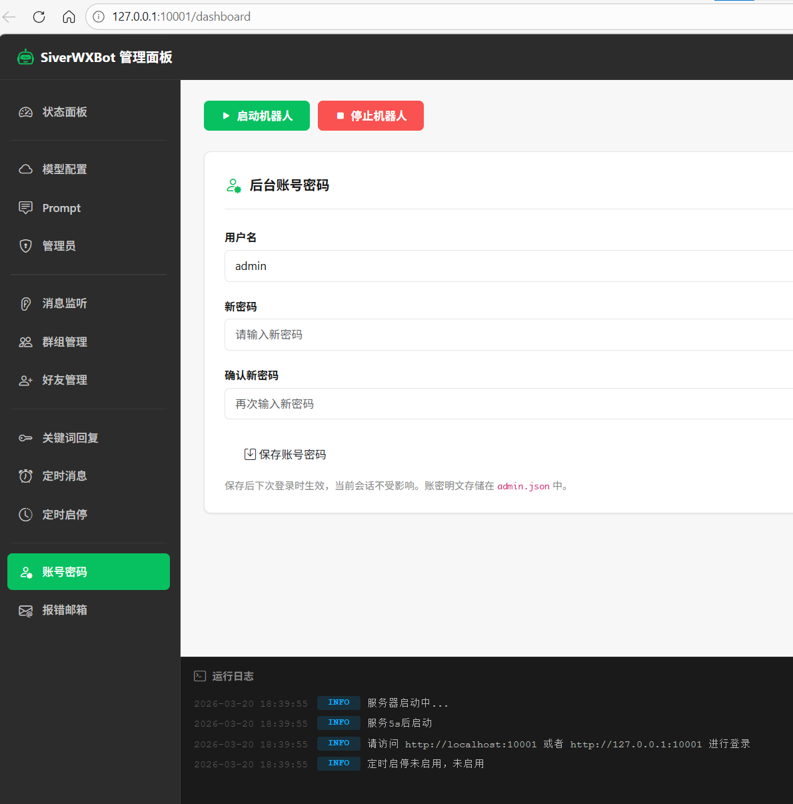

---

### 模型配置

请根据你实际使用的服务商获取 API Key、Base URL 和模型 ID。面板支持多组接口配置，选中的接口为当前默认调用接口。

**配置步骤：**

1. 进入对应服务商控制台，创建或复制可用的 API Key。

2. 回到管理面板，选择左侧**模型配置**，在接口配置中选择要使用的 SDK。

3. 按接口要求填写 **API Key**、**Base URL** 和**模型**。DusAPI、OpenAI SDK 通常填写模型 ID；Dify 的模型栏填写工作流 ID；Coze 的模型栏填写智能体 `bot_id`。

4. 点击左侧单选框选择当前使用的接口，保存配置后可使用**测试可用性**检查文字回复连通性。

5. 私聊、群组、图片识别等功能可以分别选择不同接口，请按实际模型能力配置。

---

### Prompt 配置

面板左侧 **Prompt** 栏目，用于定义 AI 的回复行为和语气内容。

- 简单示例：填写"你的所有回复后面都加一个喵~"
- 复杂示例：清晰地告诉 AI 自动回复的所有要求和任务
- 多prompt系统，可以存储多个prompt预设为每个监听单独使用设置

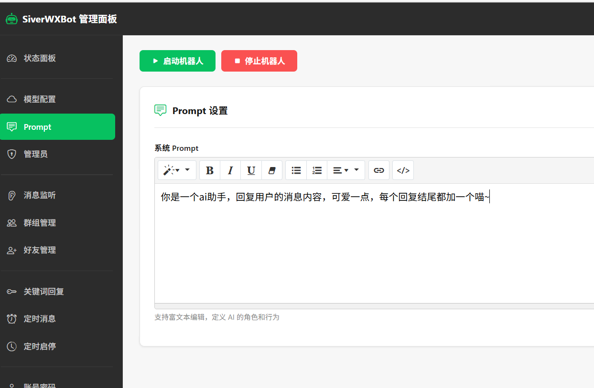

---

### 初步测试 - 调用AI接口

配置好 Prompt 和模型配置后，即可进行初步测试。

程序接管wx运行时，请勿手动干预，避免影响自动化操作。尽量减少操作电脑的次数，最好不要去手动操作wx

1. 登录你的 Windows wx，注意版本要求与[安装部署](https://wxbot.siverking.online/docs.html?c=安装部署)内说的环境要求一致。

2. 保持 wx **主窗口开着**，不要打开 wx 的其他窗口，也不要最小化 wx。然后回到面板点击上方的 `启动机器人`，等待程序启动。

3. 大概等待十几秒后程序启动完成(启动过程中wx自动吸附到左侧为正常现象)，可以将面板弹窗点掉，查看面板下方日志是否启动成功。

4. 若是日志显示**初始化微信监听器失败**,就请重启wx后再启动重试，若是重启wx不行，就将wx和面板程序都关闭重启，若是还不行那就请根据**安装部署**里的环境要求检查wx版本

5. 在**手机 wx** 上给 `文件传输助手` 发送以下指令进行测试：
   - 发送 `/状态` → 查看是否运行成功
   - 发送 `/接口测试****`（将 `****` 替换成你要测试的话，如 `/接口测试你好`）→ 测试接口配置是否成功

6. 若配置和启动都没问题，将会触发自动回复。发送 `/指令` 可查看更多指令。测试成功可在状态面板查看当前运行状态。

7. 测试成功后，点击面板上的 `关闭机器人` 按钮，随后几秒后所有功能将被关闭。

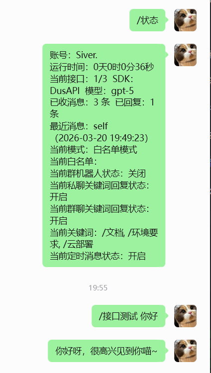

---

### 初步测试 - 不需要调用AI接口

如果你暂时不想配置模型接口，或者只想测试不消耗 AI 接口的功能，可以先使用关键词回复或自定义转发。

#### 方式一：测试关键词回复

1. 进入 **私聊监听** 或 **群组管理**，先添加要监听的联系人或群聊。
2. 如果不希望机器人调用 AI 自动回复，在对应监听页面勾选 **只监听不 AI 回复**。
3. 进入 **关键词回复**，开启私聊关键词或群聊关键词。
4. 添加一个关键词，例如左侧填 `测试`，右侧填 `收到测试消息`。
5. 启动机器人后，用已监听的联系人或群聊发送包含 `测试` 的消息。
6. 机器人命中关键词后会直接回复设置好的固定内容，不会调用 AI 接口。

#### 方式二：测试自定义转发

1. 进入 **私聊监听** 或 **群组管理**，先添加要作为来源的联系人或群聊。
2. 如果不希望来源消息触发 AI 自动回复，在对应监听页面勾选 **只监听不 AI 回复**。
3. 进入 **自定义转发**，开启自定义规则转发。
4. 新增一条规则：来源可以手动填写，也可以勾选 **全部来源**；转发类型可先选 **关键词转发** 或 **无差别转发**。
5. 填写转发目标，例如另一个联系人、群聊或文件传输助手。
6. 启动机器人后，从监听来源发送符合规则的消息，机器人会按规则转发，不需要调用 AI 接口。

> 注意：关键词回复和勾选“全部来源”的自定义转发，都依赖 **私聊监听** 和 **群组管理** 中已经配置好的监听对象。请先配置监听，再测试这些功能。

---

### 管理员配置

参照面板页面上的提示配置即可，建议保留 `文件传输助手`，或设置为自己的小号。

---

### 私聊监听配置

#### 双监听模式说明

| 模式 | 说明 |
|------|------|
| **白名单模式** | 精准监听指定个人用户（非群组，群组另外配置），只监听列表里设置的人员消息。填写给对方的**备注名**，即 wx 显示什么就填什么，否则无法监听。 |
| **黑名单模式** | 全局监听所有未读的红点消息（非群组，群组另外配置），动态管理会话列表。此时列表为黑名单，即黑名单的人员来消息时不会被处理。 |

- 全局监听（黑名单模式）：可以设置一个最大的全局监听prompt，AI回复接口采用模型配置里的默认选项
- 白名单模式：可以为每个监听对象设置不同的prompt和回复调用接口。
- 只监听不 AI 回复：开启后，私聊监听、记忆存储、关键词回复、自定义转发仍正常运行，但不会调用 AI 接口生成私聊自动回复。适合只做消息存储、关键词回复或作为自定义转发来源。

自行选择你需要的监听模式，填写好列表即可。

#### 全局模式过滤免打扰

全局监听模式下可勾选 **过滤免打扰消息**。开启后会忽略设置了免打扰的会话消息。若开启后发现全局模式不接收消息，请优先检查 Windows 屏幕缩放是否为 100%，并重启 wx 和面板后再试。

#### 启用私聊图片识别

支持识别直接发送的图片及引用图片。请在模型配置中添加一个支持视觉输入的接口和模型，开启该功能后选择对应接口即可。

开启私聊图片、语音识别后：
- 图片：支持直接发送的图片和引用图片识别。
- 语音：会调用 wx 的语音转文字能力，仅能识别普通话。若提示转文字失败，请在 wx 设置中开启「语音消息自动转成文字」。

#### 启用拆分多条回复

启用后回复会根据接口ai抉择自动发送单条或者多条消息回复。可设置**单条最大字数**和**最多发送条数**

AI 将自主决定是否将回复拆分为多条消息逐条发送，模拟真人聊天。此功能通过在 Prompt 中注入格式指令，让 AI 自主决定是否拆分及条数，每条之间加入发送延迟模拟真人。
仅适用于支持自定义 Prompt 的接口；Coze / Dify 等工作流类接口已在平台侧固化逻辑，此功能可能无效。

---

### 群组管理

勾选你想要的群组功能：

| 配置项 | 说明 |
|--------|------|
| 启用群聊监听/回复 | 开启或关闭群聊监听。关闭后群组列表不会注册监听；开启只监听模式后仅监听不调用 AI 回复 |
| 只监听不 AI 回复 | 群聊监听、记忆存储、关键词回复、自定义转发仍正常运行，但不会调用 AI 接口生成群聊自动回复 |
| 仅@时回复 | 群聊中是否仅在机器人账号被@时才回复 |
| 回复时@发言人 | 回复群消息时@发言人 |
| 回复时引用消息 | 回复群消息时引用原消息（首条引用） |
| 入群欢迎 | 是否开启新人入群欢迎功能 |
| 随机欢迎概率 | 设置触发入群欢迎的概率，拖动滑动条设置 |
| 欢迎消息 | 设置欢迎消息内容 |
| +添加群组 | 添加要监听的群组名称。若有群组备注名则采用备注名；若有同名群组，则给其中一个群组在 wx 中设置备注后，再添加备注名 |
| 启用群组图片、语音识别 | 支持通过支持视觉输入的接口和模型识别直接发送的图片及引用图片。语音会调用 wx 的语音转文字能力，仅能识别普通话 |
| 启用拆分多条回复 | 启用后回复会根据接口ai抉择自动发送单条或者多条消息回复。可设置**单条最大字数**和**最多发送条数**。AI 将自主决定是否将回复拆分为多条消息逐条发送，模拟真人聊天。此功能通过在 Prompt 中注入格式指令，让 AI 自主决定是否拆分及条数，每条之间加入发送延迟模拟真人。`仅适用于支持自定义 Prompt 的接口；Coze / Dify 等工作流类接口已在平台侧固化逻辑，此功能可能无效。` |

- 可以为每个群组设置不同的prompt预设和AI接口调用方便同时处理监听和完成每个群不同的功能服务。
- 如果只想把群聊作为关键词回复、自定义转发或记忆存储来源，请开启 **启用群聊监听/回复**，再勾选 **只监听不 AI 回复**。

#### 启用拆分多条回复

启用后回复会根据接口ai抉择自动发送单条或者多条消息回复。可设置**单条最大字数**和**最多发送条数**

AI 将自主决定是否将回复拆分为多条消息逐条发送，模拟真人聊天。此功能通过在 Prompt 中注入格式指令，让 AI 自主决定是否拆分及条数，每条之间加入发送延迟模拟真人。
仅适用于支持自定义 Prompt 的接口；Coze / Dify 等工作流类接口已在平台侧固化逻辑，此功能可能无效。

---

### 好友管理

> ⚠️ **注意：** 自动通过新好友功能为 **30s ~ 300s** 随机时间检查，请耐心等待，检查到了就会自动通过！

| 配置项 | 说明 |
|--------|------|
| 自动通过新好友申请 | 开关是否自动通过新好友申请 |
| 新好友自动回复 | 开关是否自动给新通过的好友发送打招呼消息 |
| 添加消息 | 添加打招呼消息，可添加多条；也可填写图片的完整路径，程序会自动识别并发送图片（请勿骚扰其他用户） |

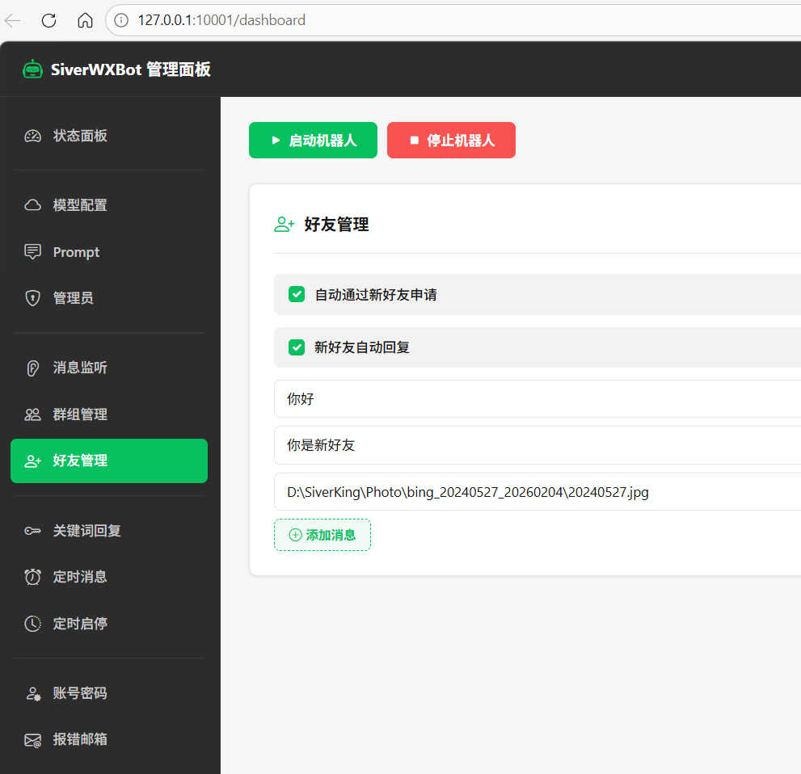  

---

### 关键词回复配置

配置群组和私聊的关键词直接回复。

关键词监听的来源依托于 **私聊监听** 和 **群组管理** 中设置的监听对象，请先在对应页面配置好监听联系人或群聊后再使用。若只需要关键词回复，不希望触发 AI 自动回复，请在对应监听页面勾选 **只监听不 AI 回复**。

| 配置项 | 说明 |
|--------|------|
| 私聊关键词回复 | 开关私聊关键词回复 |
| 群聊关键词回复 | 开关群聊关键词回复 |
| 仅在被 @ 时触发群聊关键词回复 | 开关群聊是否被@时才触发关键词 |
| 添加关键词 | 左侧填写关键词，右侧填写对应的回复内容 |

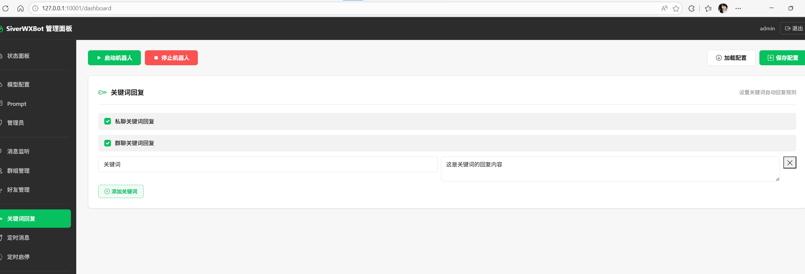  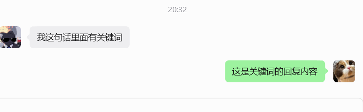

---

### 自定义转发

可以在此开启自定义转发功能，添加自定义转发任务，根据页面提示设置好自定义转发的来源、转发规则、转发目标后，启动机器人后就会监听消息并自定义转发。和私聊监听、群组监听可共存并不冲突。

自定义转发支持三类触发方式：

| 转发类型 | 说明 |
|----------|------|
| 关键词转发 | 消息内容包含任意一个关键词时触发转发 |
| 固定发送人转发 | 消息发送人匹配时触发转发 |
| 无差别转发 | 来源窗口收到的所有消息均转发 |

来源配置说明：

- 手动来源：在规则中逐个填写联系人昵称或群名。
- 全部来源：依托 **私聊监听** 和 **群组管理** 中已经设置好的监听对象，无需逐一填写来源。
- 转发来源如果已经在私聊监听或群组管理中配置过，无需重复填写，机器人启动时会跳过重复注册。
- 如果只想转发或记录消息，不希望来源消息触发 AI 自动回复，请在对应监听页面勾选 **只监听不 AI 回复**。
- 可勾选 **转发时附带来源信息**，转发内容会带上来源窗口和发送人，方便目标侧判断消息来自哪里。

---

### 定时消息

参照页面内容配置定时消息即可。若机器人一直运行着，达到定时时间时，就会触发定时消息或者随即定时消息任务并发送消息。

---

### 朋友圈

#### 随机朋友圈点赞

设置后会在规定的随机时间内打开朋友圈并点赞第一条，用于活跃账号。

#### 随机定时朋友圈

依照页面提示设置随机窗口时间发布朋友圈，防止固定时间跳过机械化。

#### 定时朋友圈

参照页面内容配置定时朋友圈即可。若机器人运行着，达到定时时间时，就会触发定时朋友圈任务并自动发布朋友圈。

---

### 定时启停

选择并配置是否定时开启机器人和关闭机器人。

---

### 记忆管理

开启后机器人运行时的所有消息将写入记忆文件，AI 回复时携带历史上下文

提示：推荐存储 3000 条，AI 带入 1000 条。数值越大 token 消耗越多，请根据实际需求调整。记忆存储依托对话名称区分对象，请手动做好 wx 备注，避免重名导致记忆混用。

- 启用对话记忆：开启后机器人运行时的所有消息将写入记忆文件，AI 回复时携带历史上下文。
- 记忆文件路径通常为 `memory/[wx号]/[窗口名]/[窗口名]_memory.json`。
- 如果窗口名含有 Windows 文件/文件夹不支持的符号，程序会自动清理非法部分；如果清理后为空或不适合作为文件名，则使用 `hash` 前缀的哈希目录存储。
- 使用清理名或哈希目录存储时，目录下会生成 `name.json` 记录原始窗口名，面板记忆查看会优先读取这个名称用于显示。
- 存储条数建议根据推荐配置

#### 记忆查看

可以在线查看和删除已经存储的记忆

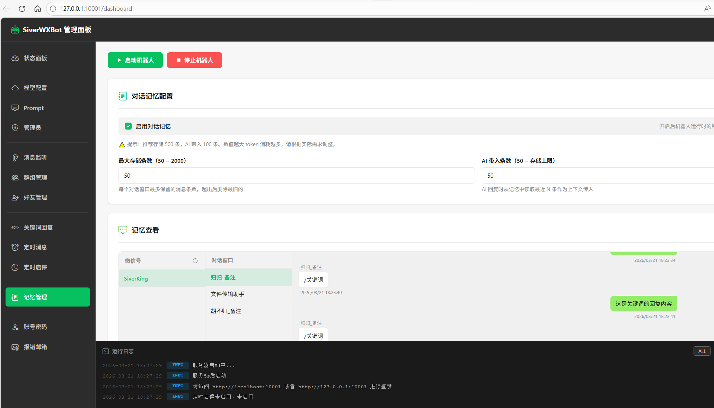
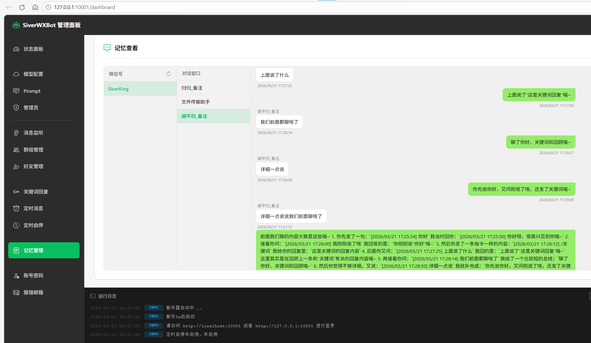

---

### 其他配置

#### 启用发送延迟

可配置模拟人工操作延时功能。配置好后发送消息前会进行随机等待以模拟人工。

#### 接口调用失败固定回复

当调用 AI / 模型接口失败时，机器人将发送此固定回复，而非原始报错提示。

可勾选“只回复一次”。开启后，同一个好友首次接口失败时会收到固定回复，后续再次失败将不再重复发送，避免接口异常时频繁打扰用户。

#### 回复次数限制

开启“回复次数限制（单个好友）”后，可以限制每个好友最多自动回复多少次。超过次数后，机器人不再继续回复该好友。

- 单个好友最多回复次数：设置每个好友的全局回复上限。
- 计数重置周期：`0` 表示永久累计，`1` 表示每天重置，`7` 表示每 7 天重置一次。
- 超出次数限制固定回复：超过上限后发送的提示语；不填写则超限后静默。
- 只回复一次：开启后，超限提示语对同一个好友只发送一次。

白名单模式下，可在监听列表中为单个好友单独设置回复上限。留空则使用全局上限。

管理员可发送 `/计数器指令` 查看计数器相关命令，也可使用 `/清除计数 昵称` 清除指定好友的回复计数与通知状态。

#### 屏蔽模型思考过程

开启后，机器人会在发送前自动清理模型返回内容中的 `<think>...</think>` 思考标签，避免把模型推理过程发送给用户。

若模型只返回了思考内容，清洗后为空，机器人会使用“接口调用失败固定回复”作为兜底回复。

---

### 报错邮箱

提供报错邮件和 wx 离线邮件提醒，按照页面提示配置邮箱即可。

---

### Webhook 通知

Webhook 通知用于在机器人出现报错时，通过 HTTP Webhook 向飞书、钉钉、企业微信、Discord 等平台发送告警。

#### 基础配置

- 启用 Webhook 通知：开启后，机器人报错时会发送 Webhook 告警。
- Webhook URL：填写第三方平台提供的 Webhook 地址。
- 请求方法：一般使用 `POST`。
- Content-Type：一般使用 `application/json`。
- 超时时间：Webhook 请求的等待时间，单位为秒。

#### 请求头和请求体

请求头需要填写合法 JSON，例如：

```json
{
  "Authorization": "Bearer your-token"
}
```

请求体同样按平台要求填写。请求头和请求体中都支持以下占位符：

- `$title`：告警标题
- `$content`：告警内容

例如通用 JSON 请求体：

```json
{
  "title": "$title",
  "content": "$content"
}
```

配置完成后，可点击“测试 Webhook”验证是否能正常发送；点击“保存 Webhook 配置”后立即生效。

---

### 数据备份

可备份配置数据

---

### 消息指令调用参考

采用管理员消息指令控制，红框为系统自动发送消息，非红框为人工发送消息。按照图内使用测试即可。

向管理员账号（`config.json` 中 `admin` 配置的微信昵称）发送命令来管理机器人。接入微信 ClawBot 后，也可以直接在 ClawBot 会话中发送本小节列出的**全部管理员指令**，与机器人微信管理员入口效果一致。

**发送 `/指令` 获取分类目录，再发送分类指令查看该类全部命令详情：**

```
/指令           → 返回全部分类目录
/系统状态指令   → 状态、接口测试、版本、更新配置
/用户管理指令   → 添加/删除/查看监听用户
/群组管理指令   → 群机器人、欢迎语全套管理
/Prompt管理指令 → 列表、查看、切换、修改 Prompt
/关键词指令     → 私聊/群聊关键词开关、@触发模式
/记忆指令       → 开关记忆、清除单用户/群/全部记忆
/延迟指令       → 开关回复延迟
/暂停恢复指令   → 只监听不 AI 回复（人工接管）
/图片识别指令   → 查看识别状态及接口
/拆分回复指令   → 查看配置、私聊/群聊独立开关
/新好友指令     → 查看自动通过及自动回复状态
/接口指令       → 接口列表、切换接口、错误回复查看/修改
/计数器指令     → 回复次数限制配置及清除计数
```

**全部管理命令列表：**

#### 系统状态

| 命令 | 说明 |
|------|------|
| `/指令` | 发送指令分类目录（也可直接发送`指令`） |
| `/状态` | 完整运行状态摘要（含所有功能开关状态） |
| `/接口测试 测试内容` | 测试当前 AI 接口是否正常 |
| `/当前版本` | 查看版本号及更新说明 |
| `/更新配置` | 热重载配置文件并重初始化监听 |

#### 用户管理

| 命令 | 说明 |
|------|------|
| `/当前用户` | 查看当前监听用户列表 |
| `/添加用户 用户昵称` | 添加白名单监听用户 |
| `/删除用户 用户昵称` | 移除白名单监听用户 |
| `/清除计数 用户昵称` | 清除指定用户的回复计数与通知状态 |

#### 群组管理

| 命令 | 说明 |
|------|------|
| `/当前群` | 查看当前监听群列表 |
| `/添加群 群名称` | 添加群聊监听 |
| `/删除群 群名称` | 移除群聊监听 |
| `/开启群机器人` | 开启群聊监听/回复总开关 |
| `/关闭群机器人` | 关闭群聊监听/回复总开关 |
| `/群机器人状态` | 查看群聊监听/回复开关状态 |
| `/开启群机器人欢迎语` | 开启群新人欢迎语 |
| `/关闭群机器人欢迎语` | 关闭群新人欢迎语 |
| `/群机器人欢迎语状态` | 查看欢迎语开关状态 |
| `/当前群机器人欢迎语` | 查看当前欢迎语内容 |
| `/更改群机器人欢迎语为 内容` | 修改群新人欢迎语内容 |

#### Prompt 管理

| 命令 | 说明 |
|------|------|
| `/Prompt列表` | 查看所有可用 Prompt |
| `/当前Prompt` | 查看当前默认 Prompt 名称及内容 |
| `/切换Prompt 名称` | 切换默认 Prompt |
| `/当前AI设定` | 查看当前默认 Prompt 内容 |
| `/更改AI设定为 新的提示词内容` | 修改默认 Prompt 文件内容 |

#### 关键词回复

| 命令 | 说明 |
|------|------|
| `/关键词状态` | 查看关键词配置及列表（含开关、@触发、引用等状态） |
| `/开启私聊关键词` | 开启私聊关键词回复 |
| `/关闭私聊关键词` | 关闭私聊关键词回复 |
| `/开启群聊关键词` | 开启群聊关键词回复 |
| `/关闭群聊关键词` | 关闭群聊关键词回复 |
| `/开启群聊关键词@触发` | 群聊关键词设为仅被 @ 时触发 |
| `/关闭群聊关键词@触发` | 群聊关键词设为无论是否 @ 均触发 |

> 💡 **提示：** 群关键词回复是否 @ 发言人、是否引用原消息需在面板配置；关键词内容在面板「关键词回复配置」中维护。

#### 对话记忆

| 命令 | 说明 |
|------|------|
| `/记忆状态` | 查看记忆开关、上下文条数和最大存储条数 |
| `/开启记忆` | 开启对话记忆 |
| `/关闭记忆` | 关闭对话记忆 |
| `/清除记忆` | 清除管理员的对话记忆 |
| `/清除用户记忆 用户昵称/群名` | 清除指定用户或群的对话记忆 |
| `/清除全部记忆` | 清除所有对话记忆 |

#### 回复延迟

| 命令 | 说明 |
|------|------|
| `/回复延迟状态` | 查看回复延迟开关及延迟范围 |
| `/开启回复延迟` | 开启回复延迟（模拟人工操作） |
| `/关闭回复延迟` | 关闭回复延迟 |

#### 暂停 / 恢复自动回复（人工接管）

| 命令 | 说明 |
|------|------|
| `/自动回复状态` | 查看私聊/群聊当前自动回复状态 |
| `/暂停私聊自动回复` | 开启私聊只监听不 AI 回复 |
| `/恢复私聊自动回复` | 关闭私聊只监听不 AI 回复 |
| `/暂停群聊自动回复` | 开启群聊只监听不 AI 回复 |
| `/恢复群聊自动回复` | 关闭群聊只监听不 AI 回复 |

> 💡 **提示：** 只监听模式下，监听、记忆、关键词回复和自定义转发保持运行，仅停止调用 AI 接口自动回复，方便人工接管。

#### 图片识别

| 命令 | 说明 |
|------|------|
| `/图片识别状态` | 查看私聊/群聊图片识别开关及所用接口 |

> 💡 **提示：** 识别开关需在面板配置，指令仅支持查看。

#### 拆分多条回复

| 命令 | 说明 |
|------|------|
| `/拆分回复状态` | 查看私聊/群聊拆分回复配置 |
| `/开启私聊拆分回复` | 开启私聊多条发送 |
| `/关闭私聊拆分回复` | 关闭私聊多条发送 |
| `/开启群聊拆分回复` | 开启群聊多条发送 |
| `/关闭群聊拆分回复` | 关闭群聊多条发送 |

> 💡 **提示：** 单条最大字数、最多条数需在面板配置。

#### 新好友管理

| 命令 | 说明 |
|------|------|
| `/新好友状态` | 查看新好友自动通过、自动打招呼及备注设置状态 |

> 💡 **提示：** 自动通过、打招呼等开关需在面板配置，指令仅支持查看。

#### AI 接口 & 错误回复

| 命令 | 说明 |
|------|------|
| `/查看接口列表` | 查看所有接口配置，▶ 标记当前使用 |
| `/选择接口 N` | 切换至第 N 个接口 |
| `/查看错误回复` | 查看接口失败时的固定回复 |
| `/设置错误回复 回复内容` | 修改接口失败时的固定回复 |

#### 回复计数器

| 命令 | 说明 |
|------|------|
| `/计数器指令` | 查看回复轮数限制、重置周期、超限话术等配置 |
| `/清除计数 用户昵称` | 清除指定用户的回复计数与通知状态 |

#### 内置 Agent（分支版本专属）

| 命令 | 说明 |
|------|------|
| `/agent 任务内容`（或 `/agent任务内容`） | 把任务交给内置 agent，如 `/agent 帮我优化默认Prompt让语气更活泼` |
| `/agent会话` | 查看当前 agent 会话列表 |
| `/选择agent会话 N` | 按列表编号切换到对应会话 |
| `/agent新会话` | 切换为新会话，重新开始 |
| `/agent停止` | 停止自己（微信管理员）发起的处理中任务 |

> 💡 **提示：** 内置 agent 为分支版本功能，有需要可前往[交流页面](https://wxbot.siverking.online/docs.html?c=%E4%BA%A4%E6%B5%81)联系作者获取。

#### 微信 ClawBot（分支版本专属）

| 命令 | 说明 |
|------|------|
| `/clawbot` | 创建连接，并把二维码链接推送到管理员微信 |
| `/clawbot状态` | 查看当前连接状态 |
| `/clawbot连接地址` | 重新发送二维码链接 |
| `/clawbot配对码 123456` | 提交手机微信显示的数字配对码 |
| `/clawbot断开` | 断开连接 |

> 💡 **提示：** 微信 ClawBot 为分支版本功能，接入后可用手机微信远程管理机器人，本小节列出的**全部管理员指令**都可以直接在 ClawBot 会话中发送使用；其中依赖监听列表或需要操作电脑端微信界面的指令（如 `/添加用户`、`/添加群`、`/更新配置`）需要电脑端机器人已启动才能执行。有需要可前往[交流页面](https://wxbot.siverking.online/docs.html?c=%E4%BA%A4%E6%B5%81)联系作者获取。

#### 暂停自动回复人工接管

向管理员账号发送指令`/暂停恢复指令`即可查看暂停和恢复自动回复的指令，用于临时暂停自动回复，方便人工接管

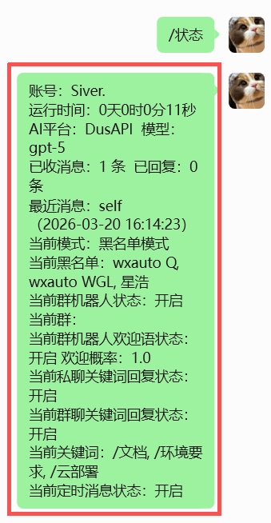 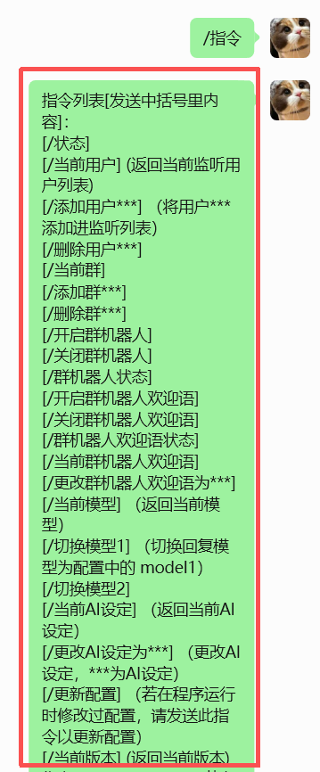 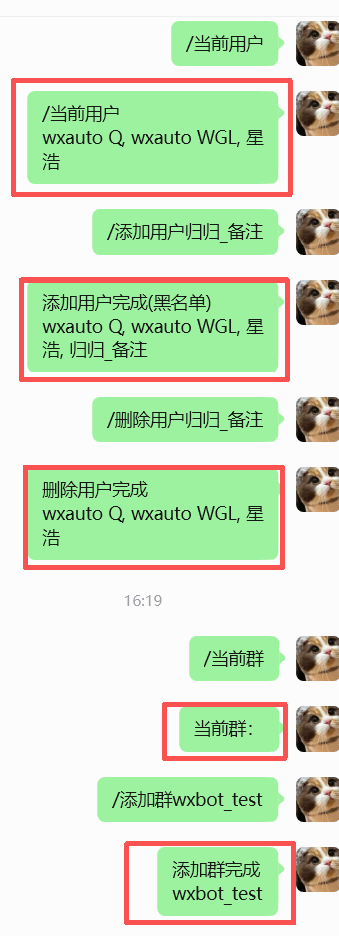 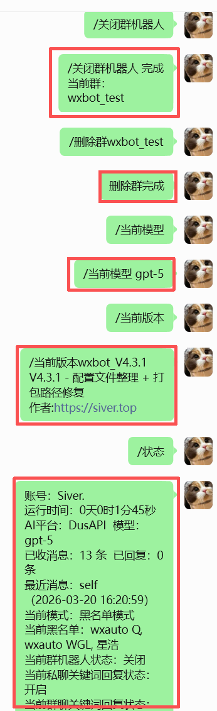

---

## AI面板管理

### 此功能内测中，有需要可前往[交流页面](https://wxbot.siverking.online/docs.html?c=%E4%BA%A4%E6%B5%81)联系作者

从 `v4.7.31` 版本起，会有一个分支内置agent的版本可获取，版本号后面加上`+agent`的版本即为分支版本，例如`v4.7.31+agent.1`，有需要可前往[交流页面](https://wxbot.siverking.online/docs.html?c=%E4%BA%A4%E6%B5%81)联系作者获取。

独立分支版本的管理面板内置了一位专属 **AI 面板管家**。它运行在你自己的 Windows 电脑上，可以通过**自然语言对话**的方式，帮你完成面板配置、客户运营、数据分析、故障排查，以及源码版的功能定制开发。不用翻文档、找字段、手改 JSON，像聊天一样把需求告诉它即可。除了在网页面板中对话，管理员还可以在微信中使用 `/agent` 指令直通同一个内置 Agent，或者接入微信 ClawBot 后通过微信使用这些能力。

> ✨ **它不只是配置助手**：从“帮我把机器人配置好”，到“帮我筛出今天值得跟进的客户”“分析这个群最近活不活跃”，再到“读取客户名单，准备定时问候任务”，都可以直接交给管家协助完成。


### 一眼看懂：它能帮你做什么

| 使用场景 | 管家能帮你做什么 | 例如 |
|-----------|----------------|------|
| 快速配置 | 设置模型、Prompt、监听、关键词、定时任务等；修改后自动校验配置 | “帮我为『XXX群』开启只在被 @ 时回复” |
| 客户触达 | 代写客户问候话术；读取本地 `.txt` 客户名单，按名单协助生成或配置定时消息任务 | “读取 `客户名单.txt`，为名单内客户配置每周一上午 10 点的问候，先让我确认文案和发送对象” |
| 获客与运营分析 | 根据本机可读取的对话记忆、消息和好友数据筛选意向客户，统计消息与新增好友，分析群聊活跃度和高频需求 | “看看最近 7 天哪些客户明确咨询过价格或合作” |
| 排查与定制 | 检查运行异常、解释原因、优化现有功能；源码版还可协助开发定制功能 | “机器人不回复了，帮我检查原因并告诉我怎么处理” |
| 微信远程对话 | 管理员通过 `/agent` 指令直通内置 Agent；接入微信 ClawBot 后，也可以在微信中继续对话和执行管理员指令 | “`/agent 帮我检查机器人为什么没有回复`” |

> 🚀 **能力不止于此**：上面只是常见用法。只要需求在本机权限和功能边界内，你都可以让管家把配置、客户数据、文案、流程和源码能力组合成新的解决方案。你的业务思路越清晰、需求描述越具体，它就越能帮你把 AI 用到日常运营中。

### 什么是 AI 面板管家

- AI 面板管家是一个内置在管理面板中的 **AI Agent（智能体）**，相当于给你配了一位 24 小时在线的专属技术助手。
- 它可以直接读取面板的配置、Prompt、记忆和日志；也能读取你明确指定的本地客户名单文件，理解需求后**替你完成操作**，并在修改后提醒你重新载入配置。
- 管家运行在本地，与机器人主程序相互独立：管家负责"帮你管理和开发"，机器人负责"自动回消息"，互不干扰。
- 管家支持三种入口：网页面板对话、机器人微信管理员 `/agent` 指令，以及独立接入的微信 ClawBot。

### 适合谁使用

- **新手用户**：看不懂字段、不会写 Prompt、不知道配置哪里出问题时，直接用大白话告诉管家即可。
- **普通用户**：需要快速完成某项配置（如开启关键词回复、添加定时消息、调整监听规则）时，一句话搞定。
- **客户运营用户**：需要整理客户名单、准备定时问候、筛选意向客户或复盘消息与群聊数据时，不必手工翻记录。
- **源码版用户**：想要自定义功能、修改界面或逻辑时，管家可以按你的要求阅读源码、完成开发并验证。
- **所有用户**：面板报错、机器人异常时，管家可以先做只读检查，给出排查顺序，不用自己盲猜。

### 使用前准备

AI 面板管家本身依赖一个大模型来工作，首次使用前需要给它配置一个可用的 AI 接口，你配置的大模型智商越高那么AI管家的效果也就越好：

1. 打开管理面板，点击左侧 **AI 面板管家** 栏目。
2. 首次进入会自动弹出**连接你的 AI 模型**引导页。
3. 选择一个**模型提供商**（内置 DeepSeek、OpenAI、Claude、Gemini、Kimi 等多家提供商，也可以填写任意 OpenAI 兼容接口）。
4. 填写对应 **API Key**（Key 保存在本地 `wxbot_agent/agent_config.json`，面板只显示脱敏状态，不回显明文）。
5. 选择或输入**模型 ID**，点击**测试连接**确认连通。
6. 点击 **保存并开始**，即可进入对话。

> 💡 **提示：** 管家使用的 AI 接口与机器人回消息用的 AI 接口是**两套独立配置**，互不影响。

> ⚠️ **注意：** 首次使用管家时，如果本地缺少 Agent 运行环境，程序会自动联网下载准备，请保持网络畅通。

### 基本使用方式

配置完成后，直接在对话框里用**自然语言**描述你的需求即可，例如：

| 你想做的事 | 可以这样对管家说 |
|-----------|----------------|
| 开启关键词回复 | "帮我开启私聊关键词回复，收到『帮助』时回复使用说明" |
| 准备客户问候 | "帮我写一段给老客户的节日问候，语气自然，不要太像群发广告" |
| 按名单配置定时消息 | "读取 `客户名单.txt`，为名单内客户配置每周一上午 10 点的问候任务，先展示名单、文案和发送时间" |
| 筛选意向客户 | "根据最近 7 天的对话记忆，筛出明确咨询过价格、预约或合作的联系人，并说明判断依据" |
| 分析群聊活跃度 | "分析『XXX群』近 7 天谁最活跃、主要讨论什么、哪些时间段最活跃" |
| 统计消息与新增好友 | "统计今天各监听会话的收发消息量，并统计最近新增或已通过的好友数量，按备注或标签整理" |
| 优化 Prompt | "帮我优化默认 Prompt，让回复语气更活泼" |
| 排查故障 | "机器人不回复消息了，帮我看看怎么回事" |

#### 在管理员微信中直通内置 Agent

先在网页的 **AI 面板管家** 页面配置并测试好模型接口，再启动 WXBot。之后，在配置的机器人微信管理员窗口中发送以下指令即可；如果记不住入口，可以先发送 `/指令` 查看管理员指令目录。

| 指令 | 用途 |
|------|------|
| `/agent` | 查看微信 Agent 指令帮助 |
| `/agent 任务内容` | 把任务直接交给内置 Agent，例如 `/agent 帮我检查机器人为什么没有回复` |
| `/agent会话` | 查看已有 Agent 会话及编号 |
| `/选择agent会话 N` | 按 `/agent会话` 返回的编号切换会话 |
| `/agent新会话` | 新建并切换到一个空会话 |
| `/agent停止` | 停止当前由机器人微信管理员发起的 Agent 任务 |

发送任务后，管理员窗口会先收到“Agent消息已经收到”的回执；Agent 在后台处理完成后，结果会继续回复到同一个管理员窗口。该入口只响应配置中的真实管理员，不会把普通联系人消息当成 Agent 指令。

#### 接入微信 ClawBot

微信 ClawBot 使用独立的微信连接，不依赖 WXBot 是否正在运行。可以通过下面任一入口开始连接：

1. 打开网页 **AI 面板管家** 页面，点击顶部中间的 **微信ClawBot** 按钮，在弹窗中扫码；如果手机微信要求数字配对码，可直接在弹窗中提交。
2. WXBot 已运行时，在机器人管理员窗口发送 `/clawbot`。程序会先回复“正在创建连接”，二维码准备好后再发送腾讯官方的 `https://liteapp.weixin.qq.com/...` 连接地址，点击后按微信提示完成连接。

常用 ClawBot 指令：

| 指令 | 用途 |
|------|------|
| `/clawbot` | 创建或继续当前连接流程 |
| `/clawbot状态` | 查看当前连接状态 |
| `/clawbot连接地址` | 重新发送当前有效的腾讯连接地址 |
| `/clawbot配对码 123456` | 提交手机微信显示的数字配对码 |
| `/clawbot断开` | 主动断开并清除本地连接凭据，下次启动不会自动恢复该连接 |

连接成功后，扫码账号就是授权账号。可以在微信 ClawBot 会话中直接发送自然语言与内置 Agent 对话，也可以使用 `/agent`、`/agent会话`、`/agent新会话`、`/agent停止` 等指令。此外，[管理面板使用](https://wxbot.siverking.online/docs.html?c=管理面板使用)中「消息指令调用参考」列出的**全部管理员指令**都可以在 ClawBot 会话中发送使用，与机器人微信管理员入口效果一致；其中依赖监听列表或需要操作电脑端微信界面的指令（如 `/添加用户`、`/添加群`、`/更新配置`）需要电脑端机器人已启动才能执行，而状态查询、接口测试及部分配置开关指令（如 `/状态`、`/接口测试`、`/开启记忆`）即使机器人未运行也可以直接使用。未主动断开时，连接凭据会保存在本机，面板重启后会自动尝试恢复。

> ⚠️ **避免监听冲突：** 如果开启了面板“私聊监听”中的“全局监听”，建议同时开启“过滤免打扰消息”，并将微信 ClawBot 会话设置为免打扰。

对话时管家会：

1. 先做**只读检查**，读取相关配置、状态和日志，不会一上来就乱改。
2. 需要修改配置时，先说明**改什么、改成什么**，只修改目标字段，保留你的其他配置。
3. 修改完成后**验证配置语法**，并提醒你点击**加载配置**和**重启载入新配置**使其生效。
4. 涉及高风险操作（如真实发消息、删除文件等）时，会**先征求你的确认**再执行。

### 管家能做什么

- **面板配置**：修改模型接口、监听名单、关键词回复、自定义转发、定时消息、朋友圈任务、记忆设置等面板中的各类配置。
- **Prompt 管理**：读写 `config/prompt/*.md`，帮你编写和优化角色、语气、禁答、转人工等规则。
- **记忆与数据**：查看、整理或清理 `memory/` 中的本地记忆。
- **客户触达与名单整理**：代写问候话术、读取本地 `.txt` 客户名单，协助生成或配置定时消息任务。
- **获客与运营分析**：从对话记忆、消息和可读取的好友数据中筛选意向客户，统计消息和新增好友，并分析群聊活跃度与高频需求。
- **状态与排查**：检查机器人运行状态、微信在线状态、错误日志，给出可验证的排查顺序。
- **源码版定制开发**：阅读并修改源码，帮助你开发自定义功能（仅源码版支持）。

### 优势点

| 优势 | 说明 |
|------|------|
| 配置到运营一体化 | 一句话完成面板配置、客户名单整理、定时问候和日常数据复盘 |
| 自然语言对话 | 不需要记字段名、记命令，用大白话描述需求即可 |
| 小白友好 | 管家内置了完整的面板使用知识，不懂的地方可以直接问 |
| 安全可靠 | 先检查再动手、修改前说明、高风险操作二次确认，凭据不回显 |
| 本地运行 | Agent 数据保存在本机，Key 脱敏展示，不经过第三方面板服务 |
| exe 版、源码版都能用 | exe 版可完成全部配置类操作，源码版还能进一步定制开发 |

### exe 版与源码版的区别

AI 面板管家在 **exe 版**和**源码版**中都可以使用，但能力边界不同：

- **exe 版**：管家可以完成配置修改、Prompt 编写、状态检查、故障排查、记忆管理等全部**面板配置类**操作；也可以帮你编写与主程序分离的独立脚本。但无法修改打包好的程序内部源码。
- **源码版**：在 exe 版全部能力的基础上，管家还可以帮你**阅读和修改源码、开发自定义功能**。

> ⚠️ **注意：** 管家会先自动识别当前运行的是 exe 版还是源码版。源码环境下修改代码前，管家会先告知准备修改的文件、功能范围和风险，**再次向你确认后才会写入**，不会擅自改动。

### 源码版自定义功能

使用源码部署的用户，可以直接用自然语言让管家帮你开发功能。常见场景：

- "给机器人加一个自动欢迎新好友的功能"（若面板已有对应功能，管家会告诉你直接配置即可）
- "把群聊回复改成先 @ 再回复"
- "帮我在面板上加一个新的配置项"
- "写一个独立的定时清理日志脚本"

流程说明：

1. 管家先阅读相关源码和现有实现，并识别当前运行形态。
2. 告知你准备修改的文件、功能范围和验证方式。
3. 你明确确认后，管家实施**最小改动**，保留你已有的修改。
4. 修改完成后至少进行语法检查或针对性测试。
5. 未经你明确要求，管家不会提交 Git、推送远端或删除文件。

### 原仓库更新后协助合并

当上游原仓库更新了新版本，你的源码版本地又存在自定义修改时，直接更新容易产生**代码冲突**。这时可以让管家协助处理：

- 在对话中告诉管家："原仓库更新了，帮我检查代码冲突并合并"。
- 管家会先检查你的本地改动、远端状态和冲突文件，向你说明冲突位置和两边的内容差异。
- 由你确认保留哪边的修改后，管家再实施合并，不会擅自替你决定。

> ⚠️ **注意：** 合并属于较高风险操作，管家合并前会说明冲突内容并征求你的确认；合并前请确认已备份或已提交你的本地修改，以免丢失自定义功能。

### 常见使用建议

- 需求描述尽量具体：说清楚对象（哪个群/哪个用户）、内容（发什么/回复什么）和时间（几点/每周几），管家配置更准确。
- 涉及 Key、密码等凭据时不要粘贴到对话中；如果管家检测到凭据，会提醒你更换。
- 管家修改配置后，记得在面板点击 **加载配置** 并 **重启载入新配置**，让修改生效。
- 如果管家回复与你的预期不符，直接追问或重新描述需求即可，对话历史会保留上下文。
- 遇到无法确认的问题（如授权、激活、兼容版本等），管家会引导你联系作者确认，不会乱猜。

---

## 远程访问服务

远程访问服务是 [SiverPanel](https://panel.siver.top) 提供的**可选增值服务**。开启后，你可以让当前这台 Windows 设备上运行的本地管理面板，通过一个固定网址被外部浏览器访问。这样无论你在手机、公司电脑，还是其他终端设备上，只要打开浏览器，就可以远程登录并管理你的机器人面板。

[SiverPanel](https://panel.siver.top) 为 SiverWXbot 提供安全远程入口。不开服务器，不配穿透，激活后直接访问。官方提供、随时访问、免服务器、免穿透

### 服务说明

- 远程访问服务的作用，是把你本机的管理面板接入 SiverPanel 服务，再通过安全入口生成一个可访问的网址。
- 访问格式为：`https://panel.siver.top/panel/安全入口`
- 例如安全入口设置为 `siver`，那么远程访问地址就是：`https://panel.siver.top/panel/siver`
- 该服务**不是必须项**。如果你只在本机使用面板，不开通远程访问服务也完全不影响正常使用。
- 该服务与 `wxautox4` **不是同一个东西**：
  - `wxautox4` 授权激活码：用于内核库设备授权
  - 远程访问服务激活码：用于开通 SiverPanel 远程访问服务
- 两者彼此独立，功能不同，也分别计费。

### 适合什么场景

- 需要在手机上远程查看机器人运行状态
- 需要在外部电脑上临时修改面板配置
- 需要在公司、家里、出差等不同设备之间管理同一台或者多台正在运行机器人的电脑

### 开通和配置步骤

1. 前往 [SiverPanel 官网](https://panel.siver.top) 获取**远程访问服务激活码**
2. 打开本地管理面板，在左侧找到 **远程访问服务**
3. 在“激活码”中填写从 SiverPanel 获取到的**远程访问服务激活码**
4. 在“安全入口”中填写你想使用的访问名称  
   例如：`siver`
5. 打开“开启远程访问服务”开关
6. 点击“连接远程服务”
7. 连接成功后，面板会显示当前远程访问地址、连接状态和服务反馈信息

### 安全入口说明

- 安全入口用于生成你的远程访问网址
- 服务端会校验安全入口格式，本地面板也会提示格式要求
- 仅支持：
  - 小写字母
  - 数字
  - 连字符 `-`
- 长度限制为 `5 - 32` 位
- 不允许以连字符开头或结尾

### 使用方式

连接成功后，使用面板中显示的远程访问地址，在任意浏览器中打开即可访问。例如：

`https://panel.siver.top/panel/你的安全入口`

打开后会进入你本机面板的远程登录页，输入你本地面板的账号密码即可管理当前面板。

### 重要注意事项

1. **请务必先修改本地面板默认账号密码**  
   如果你开启了远程访问，但仍然使用默认账密，一旦安全入口泄露，别人就可能直接尝试登录你的面板。

2. **远程访问服务依赖本机面板在线**
   - 这台 Windows 设备必须正在运行本项目
   - 本地管理面板必须处于可访问状态
   - 设备离线、程序关闭或网络异常时，远程入口将无法访问

3. **连接成功后再使用远程地址**
   如果状态页显示未连接、连接失败或设备离线，请先检查连接状态，不要直接使用远程地址。

4. **该服务会产生服务器和公网流量成本**
   因此远程访问服务为独立收费服务，仅在你有远程访问需求时按需开通即可。

### 常见使用建议

- 如果你需要经常在外部设备上查看面板状态，**建议开通**
- 如果你打算长期使用，建议选一个简洁、容易记忆、但不要过于常见的安全入口
- 若后续更换了安全入口，请以面板中最新显示的远程访问地址为准

---

## 注意事项

1. 启动机器人时不得有wx小窗口（只保留主窗口），同时确保主窗口没有最小化。
2. 电脑自动休眠 黑屏都设为**从不**（一般情况程序会自动阻止不用手动调整）。
3. 如需离线邮件提醒，请在配置面板修改设置邮件。
4. 关闭wx自动更新。
5. 适配 Windows wx `4.1.9` - `4.1.13.63`。
6. 程序接管wx运行时，请勿手动干预，避免影响自动化操作。
7. **各 SDK 接口填写说明：**
   - **DusAPI**：填写 Key、URL、模型 ID
   - **OpenAI SDK**：填写 Key、URL、模型
   - **Dify**：填写 Key、URL，模型 填写 Dify 的工作流 ID
   - **Coze**：仅需填写 Key，模型 填写 Coze 智能体 bot_id，无需填写 URL

---

## 常见问题

> ⚠️ **技术边界:** SiverWXbot_plus 基于 Windows UI Automation 与用户本人已经正常登录的桌面应用界面交互。项目不提供协议破解、DLL 注入、内存修改、身份验证或验证码绕过、风险控制或登录限制规避、自动换号、账号养号以及未经授权的数据访问能力。如果目标软件限制某项操作，SiverWXbot_plus 不承诺通过其他技术手段突破该限制。

### Q: 项目采用的技术？

**A:** 采用模拟操作(类RPA)，即为模拟人工控制操作电脑。为最安全的自动化方案。可以简单理解成有另一个“人”操作键鼠帮你自动化控制电脑，所以自动化过程中最好不要操作电脑避免发生两个人抢电脑玩的情况。

### Q: 会封号吗？

**A:** 本项目基于 `wxautox4` 开发，而 `wxautox4` 仅调用 Windows 官方 API，不涉及任何对微信客户端的侵入、破解或抓包，所有操作均模拟真实用户的手动行为。

**但请注意：** 即使您完全手动操作，以下行为同样可能触发微信风控机制：

- 曾使用任何 **hook 类或 webhook 类工具**（如 DLL 注入、itchat、数据库破解、移动端越狱魔改客户端等），以及所有同类破解或衍生工具；
- **发送消息或添加好友** 过于频繁、数量过大；
- **高频发送广告、营销内容、违法信息**，或被他人举报；
- 行为特征与 **诈骗分子** 高度相似（如多开、批量加人、群控、拉群等）；
- 行为特征与 **机器人** 高度相似（如仅 PC 端操作、移动端长期无动作；使用机器人风格的头像/昵称；发送格式机械化的消息等）；
- 扫码登录时，**手机与电脑不在同一城市**，造成异地登录；
- 在 **虚拟机、云服务器** 等虚拟环境中登录；
- 违反 **适用法律法规** 或 **微信用户协议**（详见 [微信个人账号使用规范](https://weixin.qq.com/cgi-bin/readtemplate?&t=page/agreement/personal_account&lang=zh_CN)）；
- 使用 **低权重账号** 执行过多操作。低权重账号通常包括：  
  - 新注册账号  
  - 长期未登录或不活跃账号  
  - 移动端不活跃账号  
  - 未实名认证账号  
  - 未绑定银行卡账号  
  - 曾被官方处罚的账号  
  - ...

**总而言之：** 只要您的账号质量、登录环境正常，并使账号的使用习惯接近一个真实普通人的生活账号，就能最大程度避免风控。反之，如果行为表现出明显的机器特征或诈骗特征，就会被官方判定为风险账号。

**因此，使用本工具是否触发风控，与工具本身无关，只取决于您自身的账号权重、登录环境和使用行为。**

### Q: 账号及平台风险

**A:** wxauto 是第三方开发的桌面自动化工具，并非腾讯或微信官方提供、授权或认可的软件。
使用第三方自动化工具操作微信可能受到软件版本、账号状态、平台规则及风险控制机制影响。本项目无法保证不会发生功能限制、账号限制或其他平台处置。使用者应自行阅读并遵守微信现行服务协议及账号使用规范。
wxauto 不提供、也不承诺任何规避安全机制、风险控制、账号限制或平台治理措施的能力。详见[第三方服务说明](https://wxbot.siverking.online/docs.html?c=%E7%94%A8%E6%88%B7%E5%8D%8F%E8%AE%AE#%E7%AC%AC%E4%B8%89%E6%96%B9%E6%9C%8D%E5%8A%A1%E8%AF%B4%E6%98%8E)和[可接受使用政策](https://wxbot.siverking.online/docs.html?c=%E7%94%A8%E6%88%B7%E5%8D%8F%E8%AE%AE#%E5%8F%AF%E6%8E%A5%E5%8F%97%E4%BD%BF%E7%94%A8%E6%94%BF%E7%AD%96)。

### Q: 跟wxautox4什么关系？

**A:** 该项目为wxautox4官方出品。wxautox4为python库，是该项目的依赖库。该项目基于wxautox4开发封装成品，可以理解成以wxautox4为内核的软件。联系本项目作者，即可获得wxautox4授权。

### Q: 为什么运行不正常如图片下载失败、获取不到消息、消息发送人获取不正常

**A:** 此为受windows系统屏幕缩放影响。请进入windows设置找到屏幕设置，将缩放调整为100%使用即可正常。

### Q: 为什么运行时wx会被自动吸附到左侧并且上下拉宽？

**A:** 为正常现象，这是方便软件进行自动化识别和操作最佳设置。请勿手动调整避免影响到自动化

### Q: 为什么有时会有wx窗口自动弹出？

**A:** 此为在自动化操作过程，正常现象。程序接管wx运行时，请勿手动干预，避免影响自动化操作。尽量减少操作电脑的次数，最好不要去手动操作wx

### Q: 能不能最小化？

**A:** **不能**。模拟操作自动化，需要跟真人一样，有窗口开着才能操作。

### Q: 其他AI/SDK接口如何接入？

**A:** 参照[注意事项](https://wxbot.siverking.online/docs.html?c=注意事项)或者查看[源码](https://github.com/SiverKing/SiverWXbot_plus/)。

### Q: 有没有数据安全，微信隐私问题？

**A:** 参照[隐私政策](https://wxbot.siverking.online/docs.html?c=隐私政策)。

### Q: 配置的 AI 接口不能用？

**A:** 请先检查服务商账号余额、API Key、Base URL、模型 ID 或工作流 ID 是否正确；确认接口可用后，再回到面板使用**测试可用性**排查配置问题。

### Q: 如何获取授权、激活？

**A:** [联系作者](https://www.siverking.online/static/img/siver_wx.jpg)

### Q: 运行提示防火墙？

**A:** 同意或者确认即可。

### Q: mac、linux能不能用？

**A:** **不能**。只支持x86架构的Windows。

### Q: 不会写prompt（提示词）？

**A:** 随便找一个AI，告诉他你的需求，让他给你写一份prompt模板，自行修改即可。或者上网搜索prompt模板。提示词优化工具(仅供参考)：[https://www.jyshare.com/front-end/9127/](https://www.jyshare.com/front-end/9127/)

### Q: 为什么api接口要收费？ ？

**A:** API接口消耗Token，需要消耗接口提供商的算力资源。如果不需要AI回复，也可以使用关键词回复、定时消息、自动通过好友申请并打招呼等没有用到AI接口的功能。

### Q: 我想自己开发/更改？ 

**A:** 完全可以，代码完全开源。只要拥有wxautox4内核库设备授权，自行拉取源码修改即可。或者自行基于wxautox4内核库开发别的项目

### Q: 如何更新？ 

**A:** 拉取最新的源码或者下载最新的exe，放到你旧版本的运行目录里替换或者直接使用即可。或者将旧运行目录的`config/` `memory/`文件夹备份，然后放在新的运行目录即可调用旧数据。更新前建议您备份旧运行目录的 `config/` `memory/` 文件夹，避免数据丢失。

### Q: wxautox4激活码相关？

**A:** 获取请到[交流页面](https://wxbot.siverking.online/docs.html?c=%E4%BA%A4%E6%B5%81)联系作者。一机一码，不可解换绑，特殊情况可[联系作者](https://wxbot.siverking.online/docs.html?c=%E4%BA%A4%E6%B5%81)特殊处理。激活后永久可以使用没有时间限制。一年内可以获取更新的版本，更新过期后，你已经获取的版本仍可继续永久使用。

### Q: 微信历史版本下载？

**A:** 若要下载请点击**Assets**展开后下载exe，不要点下载Download URL  [https://github.com/SiverKing/wechat4.0-windows-versions/releases](https://github.com/SiverKing/wechat4.0-windows-versions/releases)

### Q: NVDA下载？

**A:** [NVDA 蓝奏云 密码:1234](https://wwbuf.lanzout.com/b00tcoqafi)  |  [NVDA Github](https://github.com/nvaccess/nvda/releases/tag/release-2026.1.1)

---

## 用户协议

### 用户协议

最后更新日期：2026年08月28日

本协议适用于 SiverWXbot_plus 开源组件及 wxautox Plus 商业开发工具（合称“本项目”）。使用、下载、安装或购买前，请仔细阅读本协议、[可接受使用政策](https://wxbot.siverking.online/docs.html?c=%E7%94%A8%E6%88%B7%E5%8D%8F%E8%AE%AE#%E5%8F%AF%E6%8E%A5%E5%8F%97%E4%BD%BF%E7%94%A8%E6%94%BF%E7%AD%96)、[隐私政策](https://wxbot.siverking.online/docs.html?c=%E9%9A%90%E7%A7%81%E6%94%BF%E7%AD%96)及适用的授权说明。

#### 1. 项目性质

SiverWXbot_plus 是基于 Windows UI Automation 的本地桌面辅助自动化开发库，目前包含微信桌面客户端适配模块。本项目由独立第三方开发，与腾讯、微信及其他目标软件权利人不存在隶属、合作、官方认证或授权关系。

#### 2. 开源组件

SiverWXbot_plus 开源组件主要用于 Windows UI Automation 的学习、研究和个人开发。具体许可范围以项目随附的开源许可证为准。开源许可证不替代第三方软件的服务协议，也不授予用户访问或使用任何第三方数据的权利。

#### 3. Plus 商业工具

授权为本地桌面自动化开发者提供商业开发工具和技术支持。购买商业授权不代表获得任何第三方软件厂商的授权、许可或认可。授权设备、期限、更新、分发、集成及技术支持范围以[商业授权条款](https://wxbot.siverking.online/docs.html?c=%E7%94%A8%E6%88%B7%E5%8D%8F%E8%AE%AE#%E5%95%86%E4%B8%9A%E6%8E%88%E6%9D%83%E6%9D%A1%E6%AC%BE)和购买页面展示的信息为准。

#### 4. 用户义务

- 仅操作本人有权控制的设备、账号、会话和数据；
- 遵守适用法律法规、第三方软件服务协议和平台规则；
- 对自动化操作设置合理频率、人工确认和异常停止机制；
- 在处理他人信息前取得必要授权，并履行告知、保护和删除义务；
- 遵守[可接受使用政策](https://wxbot.siverking.online/docs.html?c=%E7%94%A8%E6%88%B7%E5%8D%8F%E8%AE%AE#%E5%8F%AF%E6%8E%A5%E5%8F%97%E4%BD%BF%E7%94%A8%E6%94%BF%E7%AD%96)列明的用途限制。

#### 5. 风险提示

第三方软件的版本、界面、账号状态、服务规则或风险控制机制可能随时变化。本项目无法保证持续兼容，也无法保证使用过程中不会发生操作失败、数据损失、功能限制、账号限制或其他平台处置。用户应在测试环境和小范围对象中验证，并对重要数据进行备份。

#### 6. 违规处置

如有合理依据认为商业授权被用于可接受使用政策禁止的用途，项目方可在法律允许及合同约定范围内拒绝新授权、续费、定制开发或技术支持。项目方不会以本条款为由远程删除用户软件或用户数据。

#### 7. 联系

重大变更将通过项目页面或其他适当方式通知。合规或协议问题请联系 [交流页面](https://wxbot.siverking.online/docs.html?c=%E4%BA%A4%E6%B5%81)。

---

### 可接受使用政策

最后更新日期：2026年08月28日

本政策适用于 SiverWXbot_plus、相关插件、示例及项目方提供的技术支持。

#### 允许用途

- Windows UI Automation 学习、研究和软件测试；
- 用户本人设备上的本地辅助自动化；
- 用户本人明确选择和有权操作的会话或对象；
- 低频个人效率工具、本地通知和数据整理；
- 经授权的本地工作流集成。

上述用途均以遵守法律法规、第三方软件服务协议和平台规则为前提。

#### 禁止用途

不得使用本项目或要求项目方协助：

1. 大规模或高频发送未经请求的信息，实施广告群发、垃圾信息或骚扰；
2. 自动或批量添加陌生联系人，进行获客或引流；
3. 控制账号池、实施多账号群控、养号、账号交易或租售；
4. 规避平台安全、风险控制或治理措施；
5. 绕过验证码、登录验证、身份验证、访问控制或其他技术管理措施；
6. 非法或未经授权获取、导出、使用、交易个人信息或第三方数据；
7. 干扰、破坏第三方软件、网络产品或服务的正常运行；
8. 实施诈骗、博彩引流、刷单或其他违法活动；
9. 为上述行为提供二次开发、分发、运营或技术服务。

#### 使用要求

用户应采用合理调用频率，优先选择“文件传输助手”等本人控制的对象进行测试，并为可能产生外部影响的操作设置目标核验、人工确认、日志记录和紧急停止措施。

#### 处置

如有合理依据认为商业授权被用于禁止用途，项目方可在法律允许和合同约定范围内拒绝新授权、续费、定制开发或技术支持。发现疑似违规使用可联系 [交流页面](https://wxbot.siverking.online/docs.html?c=%E4%BA%A4%E6%B5%81)。

---

### 第三方服务说明

最后更新日期：2026年08月28日

SiverWXbot_plus 是独立第三方项目，与深圳市腾讯计算机系统有限公司、腾讯、微信及其他目标软件权利人不存在隶属、合作、官方认证或授权关系。

“微信”“WeChat”“腾讯”及相关名称、商标、图标和软件归其各自权利人所有；本站仅为说明兼容对象而作必要指称，不表示任何赞助、认可或许可。

本项目不声称用户通过 SiverWXbot_plus 操作微信已经取得腾讯许可。用户须自行阅读并遵守目标软件现行的服务协议、隐私规则、账号规范和其他适用政策。

第三方软件的界面、版本、规则及技术措施可能变化。本项目不保证持续兼容，不提供规避登录验证、安全校验、风险控制、账号限制或平台治理措施的能力。

---

### 商业授权条款

最后更新日期：2026年08月28日

#### 1. 适用产品

本条款适用于 wxautox Plus 商业开发工具。购买页面另有明确约定的，以购买时展示并经用户确认的条款为准。

#### 2. 授权范围

在授权有效范围内，用户可将 Plus 用于其本人或所属组织内部、合法合规的本地桌面自动化开发、测试和辅助工作流。授权设备数量、更新期限及技术支持范围以购买页面和授权记录为准。

未经另行书面授权，不得公开传播、转售、出租、共享授权凭证，或将 Plus 本身作为面向不特定第三方的软件服务、SDK 或商业软件组件进行分发。

#### 3. 用途限制

商业授权不扩大用户对第三方软件、账号或数据的权利，也不代表获得第三方软件厂商的许可。用户必须遵守[可接受使用政策](https://wxbot.siverking.online/docs.html?c=%E7%94%A8%E6%88%B7%E5%8D%8F%E8%AE%AE#%E5%8F%AF%E6%8E%A5%E5%8F%97%E4%BD%BF%E7%94%A8%E6%94%BF%E7%AD%96)，不得将 Plus 用于批量营销、陌生用户触达、账号群控、规避平台治理或未经授权的数据处理。

#### 4. 更新与支持

订阅期内提供对应版本更新和约定范围内的开发者支持；订阅到期后，已合法获取版本的继续使用及兼容情况以购买页面说明和技术条件为准。第三方软件更新可能导致部分功能不可用，项目方不承诺永久兼容。

#### 5. 违规处置

如有合理依据认为授权被用于禁止用途，项目方可在法律允许和合同约定范围内拒绝新授权、续费、定制开发或技术支持。涉及授权范围或企业集成需求，请在使用前联系 [交流页面](https://wxbot.siverking.online/docs.html?c=%E4%BA%A4%E6%B5%81)确认。

---

## 隐私政策

最后更新日期：2026年08月28日

### 1. 适用范围

本政策说明 SiverWXbot_plus 在软件激活、更新和技术支持过程中如何处理信息。第三方软件自身的数据处理不受本政策控制，请同时查阅相应第三方的隐私规则。

### 2. 我们处理的信息

Plus 激活时可能处理设备硬件标识、授权码、激活时间、软件版本及必要的请求日志，用于许可证验证、防止授权滥用和故障排查。技术支持过程中，仅在用户主动提交时处理其联系方式、问题描述、日志或截图。

请在提交日志或截图前遮盖聊天内容、联系人、账号标识及其他不必要的个人信息。

### 3. 本地数据

桌面 UI 自动化操作原则上在用户本地设备执行。项目默认不要求用户向项目方上传聊天记录、联系人或消息内容。部分由用户自行安装、配置或调用的插件、AI 服务、HTTP 服务及第三方集成可能另行传输数据，其处理规则由相应服务提供方和用户配置决定。

### 4. 使用目的与保护

相关信息仅用于授权验证、提供更新与支持、维护安全和履行法定义务。项目方采取与风险相适应的措施限制访问和保存范围，不会将激活信息用于批量营销或出售个人信息。

### 5. 保存、查询与删除

信息将在实现上述目的所需期限及法律要求的期限内保存。用户可通过 [交流页面](https://wxbot.siverking.online/docs.html?c=%E4%BA%A4%E6%B5%81)咨询其信息处理情况，或在适用法律允许范围内申请更正、删除。

### 6. 政策更新

重大变更将通过项目页面或其他适当方式通知。继续使用前，请查看最新版本及更新日期。


---

## 交流

**项目地址**：[https://github.com/SiverKing/SiverWXbot_plus](https://github.com/SiverKing/SiverWXbot_plus)

**作者主页**：[https://www.siver.top](https://www.siverking.online)

**wxautox4内核库授权激活**: [wxautox4内核库授权激活](https://www.siverking.online/static/img/siver_wx.jpg)

**联系作者**: [联系作者](https://www.siverking.online/static/img/siver_wx.jpg)

**交流群**：**拥有wxautox4授权后，可联系作者进群**

---
